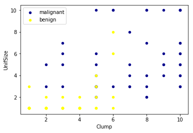
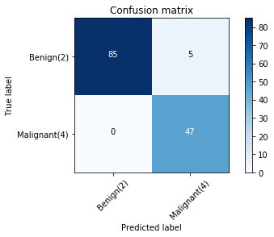

The dataset consists of several hundred human cell sample records, each of which contains the values of a set of cell characteristics. In this study, my task is to classify tumors into malignant or benign


```python
import pandas as pd
import pylab as pl
import numpy as np
from sklearn import preprocessing
from sklearn.model_selection import train_test_split
```


```python
import matplotlib.pyplot as plt
df=pd.read_csv('https://s3-api.us-geo.objectstorage.softlayer.net/cf-courses-data/CognitiveClass/ML0101ENv3/labs/cell_samples.csv')
df.head(5)
```


<div>
<style scoped>
    .dataframe tbody tr th:only-of-type {
        vertical-align: middle;
    }

    .dataframe tbody tr th {
        vertical-align: top;
    }

    .dataframe thead th {
        text-align: right;
    }
</style>
<table border="1" class="dataframe">
  <thead>
    <tr style="text-align: right;">
      <th></th>
      <th>ID</th>
      <th>Clump</th>
      <th>UnifSize</th>
      <th>UnifShape</th>
      <th>MargAdh</th>
      <th>SingEpiSize</th>
      <th>BareNuc</th>
      <th>BlandChrom</th>
      <th>NormNucl</th>
      <th>Mit</th>
      <th>Class</th>
    </tr>
  </thead>
  <tbody>
    <tr>
      <th>0</th>
      <td>1000025</td>
      <td>5</td>
      <td>1</td>
      <td>1</td>
      <td>1</td>
      <td>2</td>
      <td>1</td>
      <td>3</td>
      <td>1</td>
      <td>1</td>
      <td>2</td>
    </tr>
    <tr>
      <th>1</th>
      <td>1002945</td>
      <td>5</td>
      <td>4</td>
      <td>4</td>
      <td>5</td>
      <td>7</td>
      <td>10</td>
      <td>3</td>
      <td>2</td>
      <td>1</td>
      <td>2</td>
    </tr>
    <tr>
      <th>2</th>
      <td>1015425</td>
      <td>3</td>
      <td>1</td>
      <td>1</td>
      <td>1</td>
      <td>2</td>
      <td>2</td>
      <td>3</td>
      <td>1</td>
      <td>1</td>
      <td>2</td>
    </tr>
    <tr>
      <th>3</th>
      <td>1016277</td>
      <td>6</td>
      <td>8</td>
      <td>8</td>
      <td>1</td>
      <td>3</td>
      <td>4</td>
      <td>3</td>
      <td>7</td>
      <td>1</td>
      <td>2</td>
    </tr>
    <tr>
      <th>4</th>
      <td>1017023</td>
      <td>4</td>
      <td>1</td>
      <td>1</td>
      <td>3</td>
      <td>2</td>
      <td>1</td>
      <td>3</td>
      <td>1</td>
      <td>1</td>
      <td>2</td>
    </tr>
  </tbody>
</table>
</div>


```python
ax = df[df['Class'] == 4][0:50].plot(kind='scatter', x='Clump', y='UnifSize', color='DarkBlue', label='malignant');
df[df['Class'] == 2][0:50].plot(kind='scatter', x='Clump', y='UnifSize', color='Yellow', label='benign', ax=ax);
plt.show()
print(df.dtypes)
```





    ID              int64
    Clump           int64
    UnifSize        int64
    UnifShape       int64
    MargAdh         int64
    SingEpiSize     int64
    BareNuc        object
    BlandChrom      int64
    NormNucl        int64
    Mit             int64
    Class           int64
    dtype: object


delete rows with missing value


```python
df = df[pd.to_numeric(df['BareNuc'], errors='coerce').notnull()]
df['BareNuc'] = df['BareNuc'].astype('int')
df.dtypes
```


    ID             int64
    Clump          int64
    UnifSize       int64
    UnifShape      int64
    MargAdh        int64
    SingEpiSize    int64
    BareNuc        int64
    BlandChrom     int64
    NormNucl       int64
    Mit            int64
    Class          int64
    dtype: object


```python
feature_df = df[['Clump', 'UnifSize', 'UnifShape', 'MargAdh', 'SingEpiSize', 'BareNuc', 'BlandChrom', 'NormNucl', 'Mit']]
X = np.asarray(feature_df)
X[0:5]
```


    array([[ 5,  1,  1,  1,  2,  1,  3,  1,  1],
           [ 5,  4,  4,  5,  7, 10,  3,  2,  1],
           [ 3,  1,  1,  1,  2,  2,  3,  1,  1],
           [ 6,  8,  8,  1,  3,  4,  3,  7,  1],
           [ 4,  1,  1,  3,  2,  1,  3,  1,  1]])


```python
#df['Class'] = df['Class'].astype('int')
y = np.asarray(df['Class'])
y [0:5]
```


    array([2, 2, 2, 2, 2])


```python
X_train, X_test, y_train, y_test = train_test_split( X, y, test_size=0.2, random_state=4)
print ('Train set:', X_train.shape,  y_train.shape)
print ('Test set:', X_test.shape,  y_test.shape)
```

    Train set: (546, 9) (546,)
    Test set: (137, 9) (137,)


```python
from sklearn import svm
clf = svm.SVC(kernel='rbf')
clf.fit(X_train, y_train) 
```

    SVC(C=1.0, cache_size=200, class_weight=None, coef0=0.0,
      decision_function_shape='ovr', degree=3, gamma='auto_deprecated',
      kernel='rbf', max_iter=-1, probability=False, random_state=None,
      shrinking=True, tol=0.001, verbose=False)


```python
yhat = clf.predict(X_test)
yhat [0:5]
```


    array([2, 4, 2, 4, 2])


```python
from sklearn.metrics import classification_report, confusion_matrix
import itertools
```


```python
def plot_confusion_matrix(cm, classes,
                          normalize=False,
                          title='Confusion matrix',
                          cmap=plt.cm.Blues):
    """
    This function prints and plots the confusion matrix.
    Normalization can be applied by setting `normalize=True`.
    """
    if normalize:
        cm = cm.astype('float') / cm.sum(axis=1)[:, np.newaxis]
        print("Normalized confusion matrix")
    else:
        print('Confusion matrix, without normalization')

    print(cm)

    plt.imshow(cm, interpolation='nearest', cmap=cmap)
    plt.title(title)
    plt.colorbar()
    tick_marks = np.arange(len(classes))
    plt.xticks(tick_marks, classes, rotation=45)
    plt.yticks(tick_marks, classes)

    fmt = '.2f' if normalize else 'd'
    thresh = cm.max() / 2.
    for i, j in itertools.product(range(cm.shape[0]), range(cm.shape[1])):
        plt.text(j, i, format(cm[i, j], fmt),
                 horizontalalignment="center",
                 color="white" if cm[i, j] > thresh else "black")

    plt.tight_layout()
    plt.ylabel('True label')
    plt.xlabel('Predicted label')
```


```python
# Compute confusion matrix
cnf_matrix = confusion_matrix(y_test, yhat, labels=[2,4])
np.set_printoptions(precision=2)

print (classification_report(y_test, yhat))

# Plot non-normalized confusion matrix
plt.figure()
plot_confusion_matrix(cnf_matrix, classes=['Benign(2)','Malignant(4)'],normalize= False,  title='Confusion matrix')
```

                  precision    recall  f1-score   support
    
               2       1.00      0.94      0.97        90
               4       0.90      1.00      0.95        47
    
       micro avg       0.96      0.96      0.96       137
       macro avg       0.95      0.97      0.96       137
    weighted avg       0.97      0.96      0.96       137
    
    Confusion matrix, without normalization
    [[85  5]
     [ 0 47]]





```python
from sklearn.metrics import f1_score
print('f1 score = %.5f'%f1_score(y_test, yhat, average='weighted'))
```

    f1 score = 0.96390


```python
from sklearn.metrics import jaccard_similarity_score
print('jaccard score = %.7f'%jaccard_similarity_score(y_test, yhat))
```

    jaccard score = 0.9635036


now let's try using other kernel


```python
clf_l=svm.SVC(kernel='poly')
clf_l.fit(X_train,y_train)
pred_l=clf_l.predict(X_test)
print('f1 score = %.5f'% f1_score(y_test,pred_l,average='weighted'))
print('jaccard score = %.7f' % jaccard_similarity_score(y_test,pred_l))
```

    f1 score = 0.97107
    jaccard score = 0.9708029


    


```python
clf_s=svm.SVC(kernel='sigmoid')
clf_s.fit(X_train,y_train)
pred_s=clf_s.predict(X_test)
print('f1 score = %.5f'% f1_score(y_test,pred_s,average='weighted'))
print('jaccard score = %.7f' % jaccard_similarity_score(y_test,pred_s))
```

    f1 score = 0.33026
    jaccard score = 0.3357664


    


